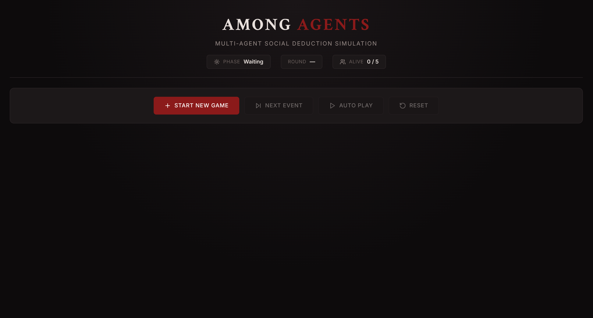
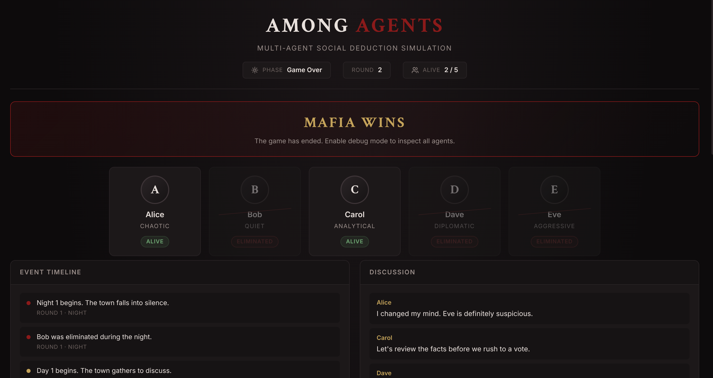
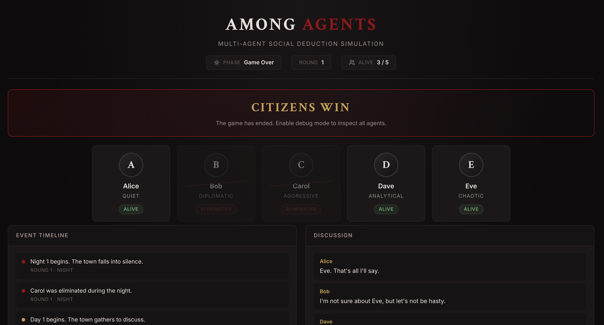

# Among Agents

**Multi-Agent Social Deduction Simulation** - 5 autonomous AI agents play a complete game of Mafia against each other in real time.



---



---



---

## Setup

### Prerequisites
- Python 3.11+
- Node.js 18+

### 1. Clone & install

```bash
git clone https://github.com/your-username/among-agents.git
cd among-agents
npm install
```

```bash
cd backend
pip install -r requirements.txt
```

### 2. Configure environment

```bash
cp backend/.env.example backend/.env
```

Open `backend/.env` and add your API key:

```
LLM_PROVIDER=openrouter
OPENROUTER_API_KEY=your_key_here
```

> No API key? The app still works — agents fall back to deterministic mock behavior.

### 3. Run

**Backend** (in one terminal):
```bash
cd backend
PYTHONPATH=. uvicorn app.main:app --reload --port 8000
```

**Frontend** (in another terminal):
```bash
npm run dev
```

Open [http://localhost:5173](http://localhost:5173) in your browser.

---

## How to use

1. Click **Start New Game** — 5 agents are assigned secret roles
2. Click **Next Event** to step through the game manually, or **Auto Play** to let it run
3. Click any agent card to inspect their state
4. When the game ends, toggle **Debug Mode** to reveal roles, suspicions, and memories

---

## API keys

| Provider | Get one at |
|---|---|
| OpenRouter | [openrouter.ai/keys](https://openrouter.ai/keys) |
| Groq (optional fallback) | [console.groq.com/keys](https://console.groq.com/keys) |
